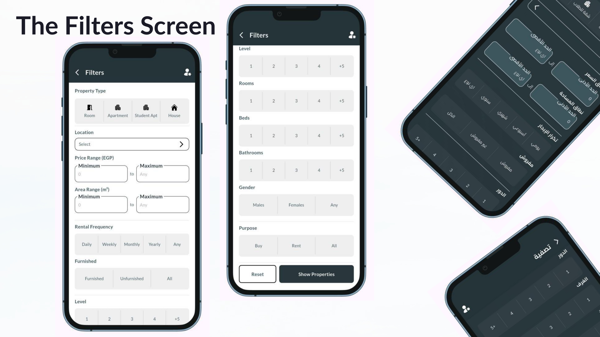

# 🏠 Sakany App

**Sakany** is a mobile app built as my graduation project 🎓. It helps students, employees, and anyone searching for housing find apartments easily — while also allowing landlords and brokers to list their properties quickly.  

---

## 🚀 Releases

You can find all official releases of **Sakany App** here:  
👉 - 📱 [Sakeny – Initial Release](https://github.com/Al-Hussein-Mohamed/Sakeny-Graduation-Project/releases/tag/v1.0.0)

## 💡 Idea  
Finding housing usually depends on connections and word of mouth. Sakany changes that by creating a reliable, centralized platform to make the process easier, faster, and smarter.  

---

## 📱 Features  
- 🔹 All apartments in one place  
- 🔹 Compare apartments (price, location, size, features)  
- 🔹 Direct chat with the landlord  
- 🔹 Easy apartment listing for individuals & brokers  
- 🔹 Real reviews + detailed info with images & maps  
- 🔹 Interactive map view with Google Maps  
- 🔹 AI-powered search (K-Means clustering)  
- 🔹 Real-time notifications  
- 🔹 Clean, modern UI (Arabic & English, light & dark themes)  

---

## ⚙️ Tech Stack  
- **Flutter** (MVC + Cubit/BLoC)  
- **Google Maps SDK**  
- **REST APIs**  
- **SignalR + Streams** (real-time chat)  
- **Firebase** (Google Sign-In + Push Notifications)  
- **OOP Concepts & SOLID Principles**  

---

## 📊 Project Scale  
- ~26,000 lines of code  
- ~50 screens  

---

## 🚀 My Role  
- Built the full Flutter mobile app  
- Implemented state management (Cubit/BLoC)  
- Integrated Google Maps & REST APIs  
- Developed real-time chat with SignalR  
- Applied OOP & SOLID for clean, maintainable code  

---

## 👨‍💻 Team

This project was built with the efforts of our amazing team:

- [Al-Hussein Mohamed](https://github.com/Al-Hussein-Mohamed) – Mobile Development (Flutter)  
- [Abanop Nashat](https://github.com/AbanoubNashat) – Mobile Development (Flutter) 
- [OmarAnalog](https://github.com/OmarAnalog) –  Backend Development (.Net)
- [Abdelazim Ahmed](https://github.com/abdalazim151) – Backend Development (.Net)

---

## 📽️ Slideshow  

Here are some slides and screenshots from the project:  

---

✨ *Sakany isn’t just a project — it’s a solution I wish I had when searching for housing as a student.*  
